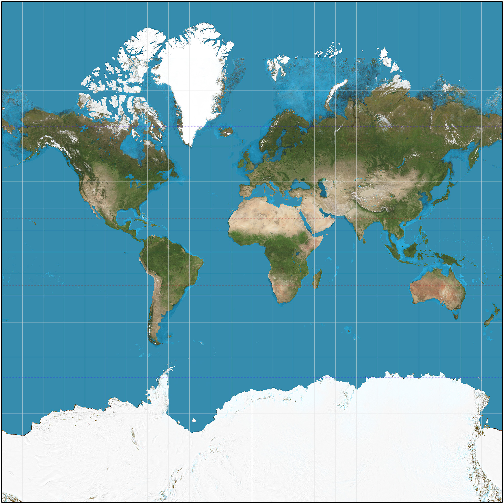

# Top2Man

Ein kleines Program, welches ich für
[Professor Dr. Stefan Schröer](http://reh.math.uni-duesseldorf.de/~schroeer/)
für die algebraische Geometrie schreibe.

Es ermöglicht nach der Klassifikation aller kompakten,
zusammenhängenden, nicht-leeren topologischen 2-Mannigfaltigkeiten,
genau diese darzustellen.

## Quellen

| Name | Link |
| ---- | ---- |
|  | [Wikipedia-User Strebe](https://commons.wikimedia.org/wiki/User:Strebe) |